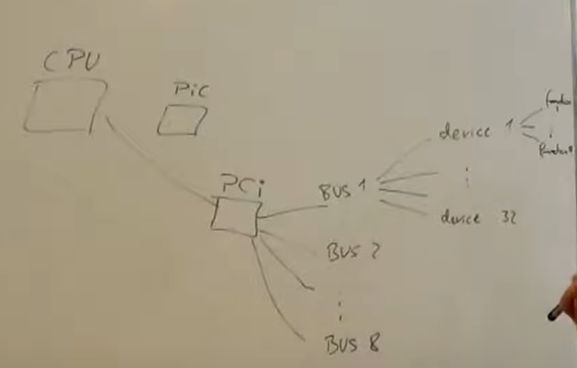
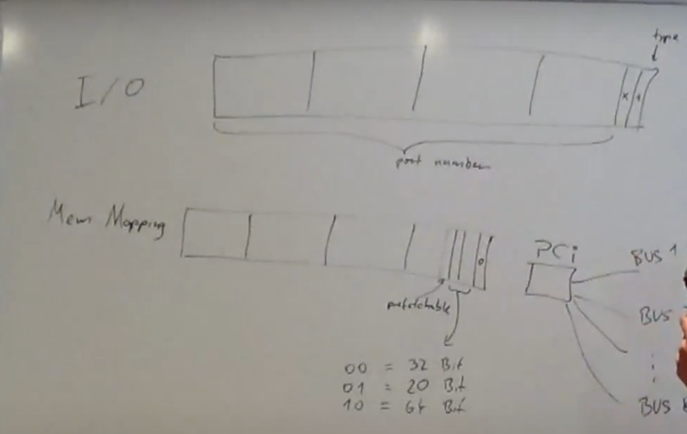

# We managed till Keyboard and mouse, which I had exp. w earlier, now moving on to PCI, I will make notes

### Peripheral Component Interconnect (PCI)

1. Has **8 busses**. **(3 bits)**
2. Every bus can have upto **32 devices**. **(5 bits)**
3. Every device can have upto **8 function**. **(3 bits)**

   Classic ecamples, sound card has two functions, audio capture device and audio output device (OG sound card)
4. We will **query** in the following **format**:
   "What is Y device on X bus"
   We will get two 32 bit integers as answer,

   1. **uint32_t vendor_id** -> Smaller vendors share ids,
   2. **uint32_t device_id**
   3. Metadata:
      1. **uint16_t class_id**,
      2. **uint16_t subclass_id**

### Base Address Registers

Till now we used hardcoded addresses, but now we will assign various addresses to various ports.
This is the solution for having multiple devices of same types, like having 2 keyboards.

* **I/O type Base Address Registers**
  * Last two bits have to be set to 1 (includes **LSB**).
  * Hence port number has to be a multiple of 4.s a kind of hardware restriction.
* **Memory Mapping Base Address Registers**
  * There are specific memory locations for reading and writing data.
  * LSB = 0
  * Prefetchable bit -> OS might prefetch some locations of hard disk, but not keys strokes
  * The middle two bits indicate the length of BAR(Base Address Register)
    * 00 -> 32 Bit BAR
    * 01 -> 20 Bit BAR
    * 10 -> 64 Bit BAR
